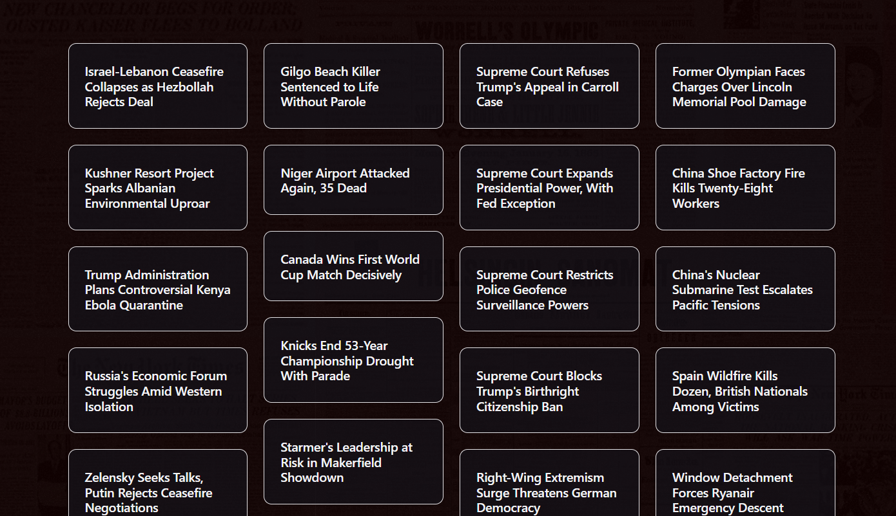
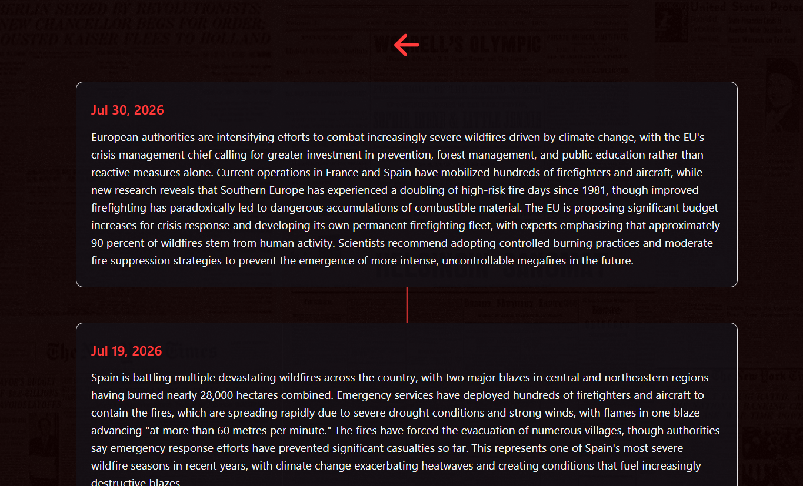

# REDSTRINGNEWS
Local news aggregator and timeline creator. 

## About Project

Redstringnews uses RSS Feeds, Natural Language Processing, and LLM summaries to gather current news stories and sort them into relevant timelines. 

The process looks like this:

1. Stories gathered from RSS feeds
2. Stories are given a vector embedding and clustered based on similarity/subject matter
3. Clusters are turned into a new short summary via anthropic api
4. Vector embedding of new score is compared to existing timelines to find possible fits
5. Final sorting process uses LLM to gauge candidates for timeline fit

I created this project because I was tired of being dropped into the middle of ongoing stories on social media with no context. With this project, I am able to see how timelines develop and make informed conclusions about stories. 

## Media





## Dependencies

For this project you need to have:
- Docker
- An Anthropic API key

## Setup

First, clone repository with
```bash
git clone https://github.com/kNeff9/redstring.git
```

Then, create **.env** file in root directory and fill out according to **.env.example**:

```
export ANTHROPIC_API_KEY = # Insert your api key here

DB_HOST=localhost
DB_PORT=5433
DB_NAME=redstring
DB_USER=postgres
DB_PASSWORD= # Enter any value
```
--- 
### Note:

Before seeing any stories or timelines, you need to run the aggregator pipeline. Here is how to do this:

```bash
cd aggregationPipelineTesting
python -m venv venv
```

Activate it:

**Windows**
```bash
venv\Scripts\activate
```

**Mac/Linux**
```bash
source venv/bin/activate
```

Install dependencies and run:

```bash
pip install -r requirements.txt
python main.py
```

This allows the story collection/timeline organization process to run. 

--- 

Now, you can spin up the docker container to see the stories you have collected.

```bash
docker compose up --build
```